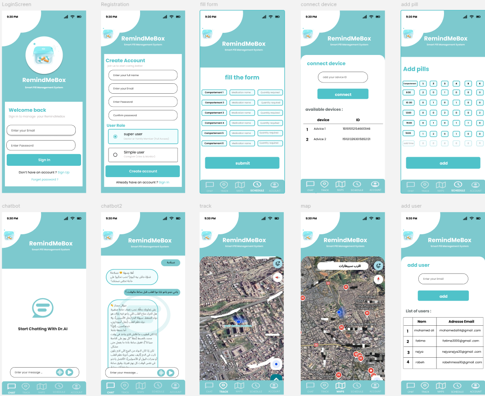

# RemindMeBox

**RemindMeBox** is a Flutter-based mobile application demo for a **Smart Pill Management System**, developed as part of our participation in **TSYP 13 – “Power to Empower”** challenge. The app helps users manage medication schedules, track pill intake, connect to devices, and locate nearby hospitals, while providing a simple AI-powered chatbot for guidance.

---

## Features

### Authentication
- **Login as Super User**: Full control, device connection, add users, manage pills.  
- **Login as Simple User**: View schedule, track pills, access chatbot and hospital map.  

### Pill Management
- View daily pill schedule with visual reminders.  
- Add pills to the schedule (Super User).  
- Receive notifications if medicine was not taken on time.  

### Device Connection (Super User)
- Connect and manage smart pill boxes.  
- Display available devices.  

### Location & Tracking
- Track current location on a map.  
- Locate nearby hospitals using Flutter Map and OpenStreetMap tiles.  

### Chatbot
- Simple AI-powered chatbot named **Dr. AI**.  
- Provides basic guidance and responses to health-related queries.  

### User Management (Super User)
- Add new users with name and email.  
- View the list of added users.  

### Profile & Logout
- View user role and demo email.  
- Logout to switch users.

---

## Screenshots

 

- Login Screen  
- Connect Device Screen  
- Home Screen with Bottom Navigation  
- Pill Schedule Screen  
- Hospital Map & Tracking  
- Chatbot  

---

## Tech Stack

- **Flutter**: For building cross-platform mobile UI.  
- **Dart**: Programming language.  
- **flutter_map**: OpenStreetMap integration.  
- **latlong2**: Handling geographical coordinates.

---

## Getting Started

### Prerequisites
- Flutter SDK installed: [Flutter Installation Guide](https://docs.flutter.dev/get-started/install)  
- Device or emulator for running the app.

### Installation
1. Clone the repository:
   ```bash
   git clone https://github.com/<your-username>/remindmebox.git
